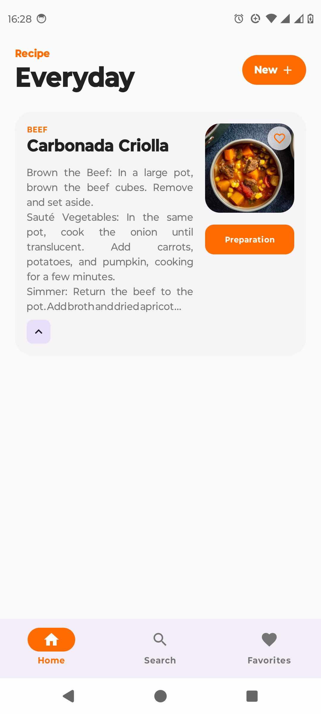
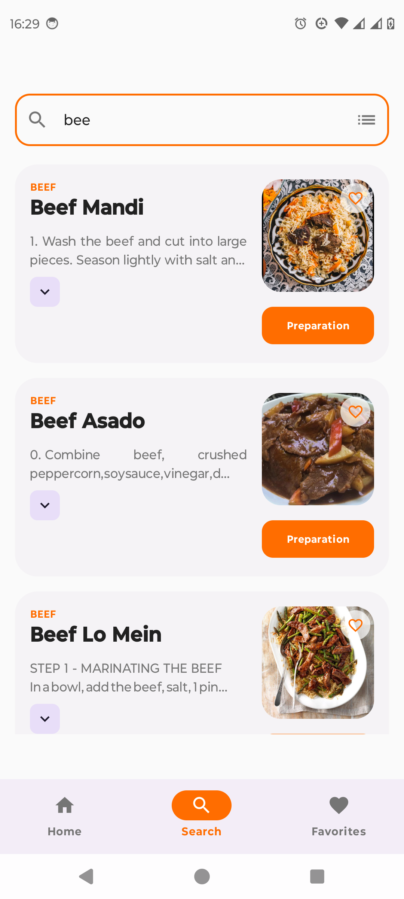
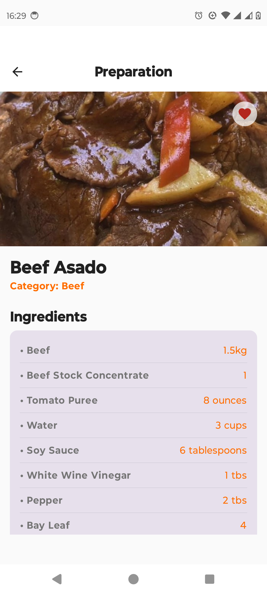
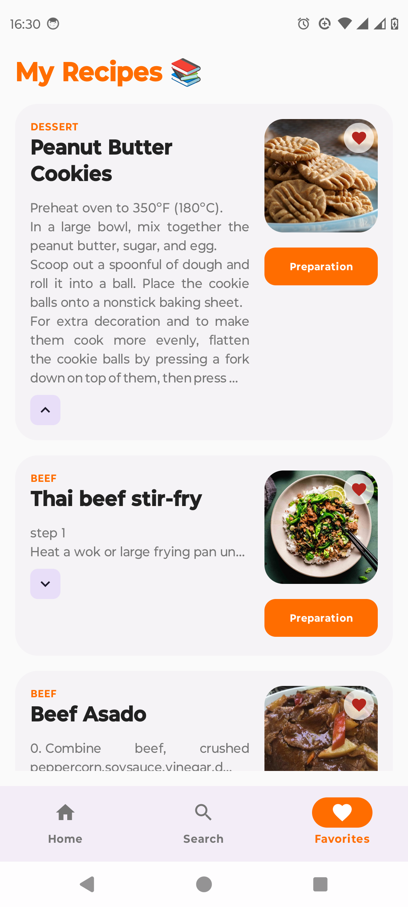

# 🍲 Recipe App - Modern Android Architecture

  <a href="#-english">🇺🇸 English</a> | <a href="#-português">🇧🇷/🇵🇹 Português</a>

 

## 🇺🇸 English

A native Android application developed to demonstrate the best practices and modern technologies of the Android ecosystem (Modern Android Development - MAD). The app consumes the public [TheMealDB](https://www.themealdb.com/api.php) API to display recipes, categories, and allow intelligent searches.

### 📱 Screenshots & Demo

> **Note:** *[Add your screenshots or a GIF here. A GIF showing the Shimmer Effect and Smart Search is highly recommended!]*

   &nbsp;&nbsp;
   &nbsp;&nbsp;
   &nbsp;&nbsp;
  

### ✨ Key Features (Highlights)

More than just a recipe app, this project focuses on **User Experience (UX)** and **Clean Code**:

* **Smart Search:** The `SearchViewModel` analyzes user input in real-time. Typing a category (e.g., "Dessert") or region intelligently routes to optimized API filter endpoints instead of a basic text search.
* **Custom Shimmer Effect:** A reusable Jetpack Compose `Modifier` that creates high-performance "Skeleton Loading" animations, avoiding layout shifts and providing a premium feel.
* **Global Network Monitoring:** A connectivity detective (`NetworkMonitor` via `Flow`) that observes Wi-Fi/Data state and displays dynamic Snackbars on the main screen in real-time.
* **Internationalization (i18n):** Native support for English (Default) and Portuguese, automatically adapting the UI based on the device's language settings.
* **Unit Testing:** Implemented using JUnit and MockK, ensuring the reliability of the ViewModel's complex business logic (Smart Search routing) without needing an emulator.

### 🛠️ Tech Stack & Architecture

* **UI:** Jetpack Compose, Material Design 3, Coil (Image caching).
* **Architecture:** MVVM (Model-View-ViewModel), Repository Pattern, UDF (Unidirectional Data Flow).
* **Concurrency & Reactive:** Kotlin Coroutines & Flow.
* **Dependency Injection:** Dagger Hilt.
* **Networking:** Retrofit & OkHttp.
* **Testing:** JUnit 4 & MockK.

### ⚙️ How to run the project

1. Clone the repository: `git clone https://github.com/IagoRochaDev/RecipeApp-Android.git`
2. Open the project in **Android Studio**.
3. Run the app on an Emulator or Physical Device (`Shift + F10`). *(No private API key is required).*

### 🚀 Roadmap (Next Steps)

Software is a continuous journey. Here are the planned architectural and feature improvements for the next iterations:

* **CI/CD Pipelines:** Set up GitHub Actions to automatically run unit tests and build the APK on every Pull Request.
* **UI/Instrumented Tests:** Expand the test suite by adding UI tests with Jetpack Compose Testing to ensure screen components render correctly.
* **Pagination (Paging 3):** Implement infinite scrolling on the home and search screens to optimize memory usage when dealing with large datasets.
---

## 🇧🇷/🇵🇹 Português

Aplicativo Android nativo desenvolvido para demonstrar as melhores práticas e tecnologias modernas do ecossistema Android (Modern Android Development - MAD). O app consome a API pública [TheMealDB](https://www.themealdb.com/api.php) para exibir receitas, categorias e permitir buscas inteligentes.

### ✨ Funcionalidades Principais (Highlights)

Mais do que um simples app de receitas, este projeto foi focado em **Experiência do Utilizador (UX)** e **Código Limpo**:

* **Busca Inteligente (Smart Search):** O `SearchViewModel` analisa o input do utilizador em tempo real. Se digitar uma categoria (ex: "Dessert") ou região, o app faz o roteamento inteligente para os endpoints de filtro da API.
* **Shimmer Effect Customizado:** Implementação de um `Modifier` reutilizável em Jetpack Compose para criar animações de "Skeleton Loading" de alto desempenho, substituindo os clássicos *spinners*.
* **Monitoramento de Rede Global:** Observa o estado do Wi-Fi/Dados via `Flow` e exibe *Snackbars* dinâmicas na tela principal em tempo real.
* **Internacionalização (i18n):** Suporte nativo para Inglês (Padrão) e Português, adaptando toda a interface baseada nas configurações do aparelho do utilizador.
* **Testes Unitários:** Implementados com JUnit e MockK para garantir a estabilidade das regras de negócio (roteamento da Busca Inteligente) isolando dependências.

### 🛠️ Stack Tecnológico e Arquitetura

* **UI:** Jetpack Compose, Material Design 3, Coil (Cache de imagens).
* **Arquitetura:** MVVM (Model-View-ViewModel), Repository Pattern, UDF (Fluxo Unidirecional de Dados).
* **Assincronismo e Reatividade:** Kotlin Coroutines & Flow.
* **Injeção de Dependências:** Dagger Hilt.
* **Rede:** Retrofit & OkHttp.
* **Testes:** JUnit 4 & MockK.

### ⚙️ Como executar o projeto

1. Faça o clone do repositório: `git clone https://github.com/IagoRochaDev/RecipeApp-Android.git`
2. Abra o projeto no **Android Studio**.
3. Execute o projeto num Emulador ou Dispositivo Físico (`Shift + F10`). *(Nenhuma chave de API privada é necessária).*

### 🚀 Próximos Passos (Roadmap)

Software é uma jornada contínua. Aqui estão as melhorias de arquitetura e funcionalidades planeadas para as próximas iterações:

* **Pipelines de CI/CD:** Configurar GitHub Actions para rodar testes unitários e gerar o APK automaticamente a cada Pull Request.
* **Testes de UI/Instrumentados:** Expandir a cobertura de código adicionando testes de interface com o Jetpack Compose Testing.
* **Paginação (Paging 3):** Implementar scroll infinito nas listas (Início e Busca) para otimizar o uso de memória ao lidar com muitos dados.
---

## 🧑‍💻 Author / Autor

Developed by / Desenvolvido por Iago Rocha Oliveira

* **LinkedIn:** https://www.linkedin.com/in/iagorochadev/
* **Portfolio:** https://github.com/IagoRochaDev/
* **Email:** iagor.oliveira00@gmail.com

*If you liked the project, please leave a ⭐ / Se gostou do projeto, deixe uma ⭐*